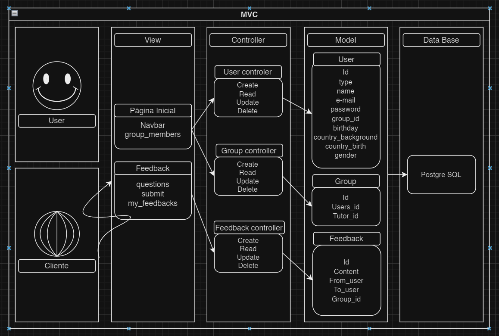

# Sistema de Interação com o Usuário

## Usuário
É a pessoa que interage com o sistema através de um cliente.

## Cliente
É onde o usuário realiza ações que disparam requisições para o servidor.

## View
- **Página Inicial (Homepage)**: Possui componentes como 'Navbar' e 'group_members', que são partes da interface de usuário que o cliente renderiza.
- **Feedback**: Contém elementos como 'questions', 'submit' e 'my_feedbacks', utilizados para interação com o sistema de feedback.
- **group_members**: seria uma visualização de todos os membros do grupo em uma única seção

## Controller
- **User controller**: Controla as operações de CRUD (Create, Read, Update, Delete) para os usuários.
- **Group controller**: Gerencia as operações de CRUD para grupos.
- **Feedback controller**: Administra as operações de CRUD para o sistema de feedback.

## Model
- **User**: Define a estrutura de dados para usuários, incluindo campos como 'id', 'type', 'name', 'e-mail', etc.
- **Group**: Estrutura para grupos, com campos como 'id', 'Users_id', 'Tutor_id'.
- **Feedback**: Contém campos como 'id', 'Content', 'From_user', 'To_user', 'Group_id' para gerenciar o feedback entre usuários.

## Banco de Dados
- **PostgreSQL**: O sistema de gerenciamento de banco de dados usado para os dados do site.

## Link do Diagrama
[Diagrama do Sistema](https://drive.google.com/file/d/1lw-ESs4OTFq8BlBfci_31RR6RQgiwkna/view?usp=sharing)
